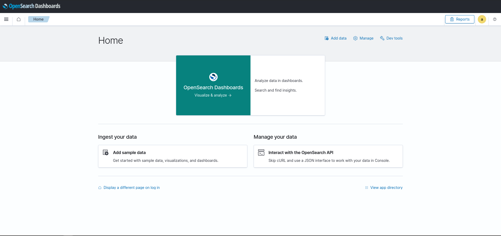

# Reports File Server for OpenSearch Dashboards

## Overview

The **Reports File Server** is a custom plugin for **OpenSearch Dashboards** designed to add a navigation option to fetch PDF reports under the local home directory of the OSD Node in the GUI.

The "report" navigation button is attached to the top nav bar so it remains reachable from every route. A link is also attached to the side bar as showed in the screenshot below.

## Features




## Installation

1. sudo bin/opensearch-dashboards-plugin install https://github.com/geoloe/report_file_server/raw/refs/heads/main/build/reportFileServer-2.18.0.0.zip
2. Restart opensearch-dashboards.service

## Usage

Once the plugin is installed and OpenSearch Dashboards is running, the **Reports File Server** will automatically be active. All pdfs that are under the current mnt directory in a folder called "reports" will be fetched for the the user to download over the GUI.
Files under /mnt/reports will be available in the GUI. You can create a reports folder with the necessary permissions (e.g. chmod 755) and the files can be downloaded.

### Note

Please note that in order to separate files from each tenant the names of the pdfs need to have the tenant name configured (case-insensitive). So for instance:

admin.pdf. Will only be available for the admin tenant. 

Files with `[DAILY]` will be filtered and displayed onder the daily reports tab.
Files with `[MONTHLY]` will be filtered and displayed onder the monthly reports tab.

All pdfs need to be in the same "reports" folder without subfolders.
If not the files won't be available.

## Development

To modify and test the plugin locally:

1. Run OpenSearch Dashboards in development mode.
2. Make changes to the plugin code.
3. Reload OpenSearch Dashboards to see the changes in effect.

### Running Locally
- To run the OpenSearch Dashboards instance locally, use the following command:
  ```bash
  yarn start
  ```

## Contributing

Feel free to fork the repository, make changes, and create pull requests.

## License

This plugin is licensed under the [Apache 2.0 License](LICENSE).